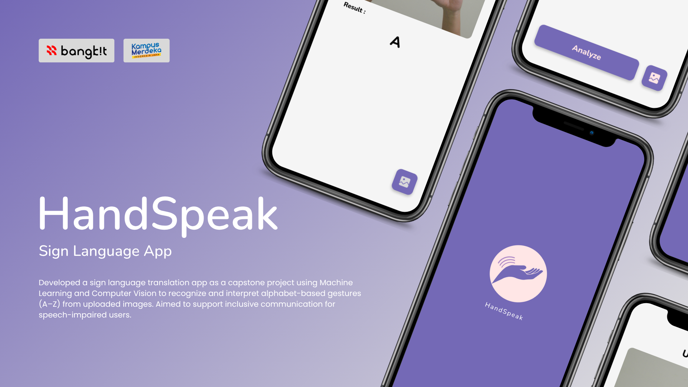

# **HandSpeak - Sign Language App**

**HandSpeak** is a capstone project developed as part of the **Bangkit Academy 2024** graduation requirement. This application leverages **Machine Learning** and **Computer Vision** to recognize and translate alphabet-based sign language (A–Z) into text using uploaded images. Designed with inclusivity in mind, HandSpeak aims to bridge communication gaps for individuals with speech impairments.

## 🔍 Project Summary

> The development of a sign language detection application is a significant advancement in technology that aims to assist non-speaking individuals in communicating.

The **HandSpeak App** is designed to:
- Detect and interpret sign language gestures from A to Z.
- Translate gestures into corresponding letters using a custom-trained machine learning model.
- Enable inclusive communication between those who use sign language and those who do not understand it.

This innovation promotes accessibility, inclusivity, and independence for users in educational, social, and caregiving environments.

---

## 👨‍💻 Tech Stack

- **Mobile Development**: Kotlin (Android)
- **Cloud Computing**: Google Cloud
- **Machine Learning**: TensorFlow, Python
- **Design**: Figma

---

## 👥 Team Members

| Role         | Name                               | University                                | ID              |
|--------------|------------------------------------|-------------------------------------------|-----------------|
| ML Engineer  | Muhammad Fikrizza                  | Universitas Ahmad Dahlan                  | M179D4KY2229    |
| ML Engineer  | Juan Samuel Christopher            | Universitas Gunadarma                     | M009D4KY3113    |
| ML Engineer  | Mochammad Syahrindra A. Suharno    | Universitas Widyatama                     | M476D4KY3186    |
| Cloud        | Nugroho Rahmanto                   | Universitas Telkom                        | C012D4KY0190    |
| Cloud        | Made Nanda Wija Vahindra           | Institut Teknologi Sepuluh Nopember       | C004D4KY1266    |
| Mobile Dev   | Alfiessa Widya Wirawan             | Universitas Telkom                        | A012D4KY3385    |
| Mobile Dev   | Elvira Wulandari                   | Universitas Telkom                        | A012D4KX3571    |

---

## 🚀 How to Run

1. Clone this repository
2. Open the Android project in Android Studio
3. Run on Android emulator or physical device
4. Select an image containing a hand sign (A–Z)
5. View the predicted alphabet
